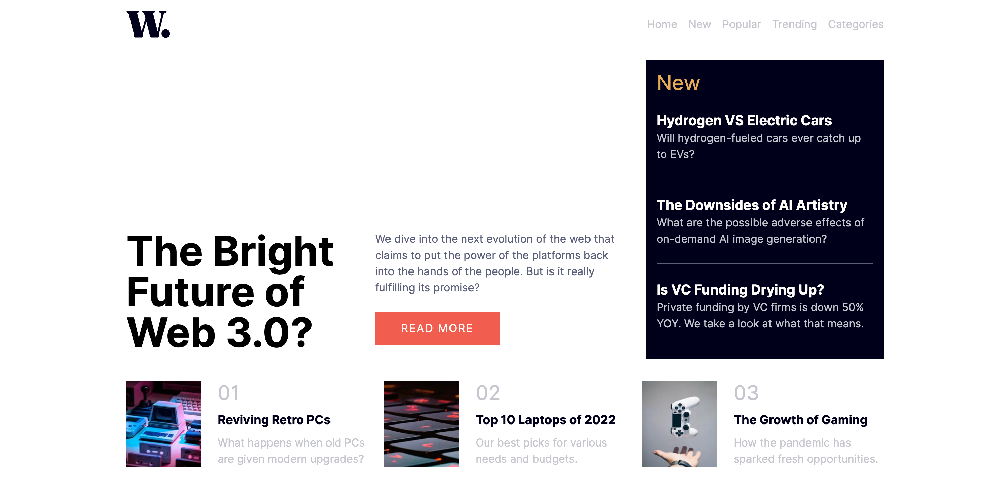

# Frontend Mentor - Interactive rating component solution

This is a solution to the [News homepage challenge on Frontend Mentor](https://www.frontendmentor.io/challenges/news-homepage-H6SWTa1MFl). Frontend Mentor challenges help you improve your coding skills by building realistic projects. 

## Table of contents

- [Overview](#overview)
  - [The challenge](#the-challenge)
  - [Screenshot](#screenshot)
  - [Links](#links)
- [My process](#my-process)
  - [Built with](#built-with)
  - [What I learned](#what-i-learned)
  - [Continued development](#continued-development)
  - [Useful resources](#useful-resources)
- [Author](#author)

**Note: Delete this note and update the table of contents based on what sections you keep.**

## Overview

### The challenge

Users should be able to:

- View the optimal layout for the interface depending on their device's screen size
- See hover and focus states for all interactive elements on the page

### Screenshot

- Desktop Version


### Links

- Solution URL: [https://github.com/vitaovich/frontend-news-homepage](https://github.com/vitaovich/frontend-news-homepage)
- Live Site URL: [https://delightful-glacier-09840f31e.2.azurestaticapps.net/](https://delightful-glacier-09840f31e.2.azurestaticapps.net/)

## My process

### Built with

- Mobile-first workflow
- [React](https://reactjs.org/) - JS library
- [Next.js](https://nextjs.org/) - React framework
- [TailwindCSS](https://tailwindcss.com) - For styles
- [Azure Static Web Apps](https://azure.microsoft.com/en-us/products/app-service/static) - For deployment and hosting
- [Google Fonts](https://fonts.google.com/specimen/Overpass)

### What I learned

- Applying NextJS Image Optimization to fill a div for topics
    ```tsx
    <div className='relative w-1/3'>
        <Image
        alt={props.imageAlt}
        src={props.imagePath}
        fill
        />
    </div>
    ```

- Opacity and using z-index for menu popout on right side of the screen in mobile view
    ```css
    bg-slate-800/50 justify-end fixed top-0 right-0
    ```

- Using Tailwind CSS grids for layout in desktop and mobile view
    ```css
    grid grid-cols-1 md:grid-cols-3 gap-6
    ```

### Continued development

I plan to continue diving deeper into React and NextJS for tougher challenges requiring more interactivity.

### Useful resources

- [Deploy hybrid Next.js websites on Azure Static Web Apps](https://learn.microsoft.com/en-us/azure/static-web-apps/deploy-nextjs-hybrid) - Useful for learning how I deployed my site.
- [Learn to use Bash with the Azure CLI](https://learn.microsoft.com/en-us/cli/azure/azure-cli-learn-bash) - Useful for how to use scripting with Azure CLI

## Author

- Website - [Vitaliy Alekhnovich](https://www.vitoal.com)
- Frontend Mentor - [@vitaovich](https://www.frontendmentor.io/profile/vitaovich)